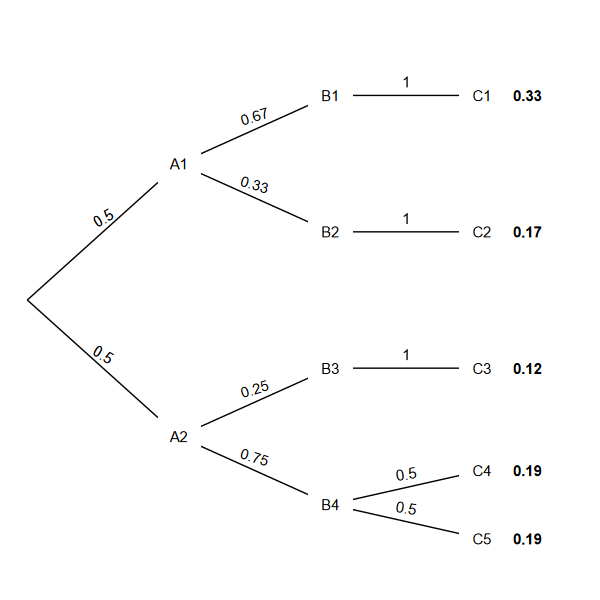

# The ptree R package

A fork of the `ptree` package. This `R` packages makes it easy to draw probability trees in R. Turn this:

```r
library("dplyr")

ids <- c(
    "A1", "B1", "C1",
    "A2", "B2", "C2",
    "B3", "C3",
    "B4", "C4",
    "C5"
  )

path_nodes <- lapply(ids, function(id) path_node(id))

p <- path(path_nodes)
p <- p %>%
  add_root_edge("A1", 1/2) %>%
  add_root_edge("A2", 1/2) %>%

  add_edge("A1", "B1", 2/3) %>%
  add_edge("B1", "C1", 1.0) %>%
  add_edge("A1", "B2", 1/3) %>%
  add_edge("B2", "C2", 1.0) %>%
  add_edge("A2", "B3", 1/4) %>%
  add_edge("B3", "C3", 1.0) %>%
  add_edge("A2", "B4", 3/4) %>%
  add_edge("B4", "C4", 1/2) %>%
  add_edge("B4", "C5", 1/2)

tree <- compute_tree( p )
draw_tree( tree )


```

or this

```r
df_nodes <- bind_rows(
  list(text = "A1", parent = 0, p = 1/2),
  list(text = "B1", parent = 1, p = 2/3),
  list(text = "C1", parent = 2, p = 1  ),
  list(text = "B2", parent = 1, p = 1/3),
  list(text = "C2", parent = 4, p = 1  ),
  list(text = "A2", parent = 0, p = 1/2),
  list(text = "B3", parent = 6, p = 1/4),
  list(text = "C3", parent = 7, p = 1  ),
  list(text = "B4", parent = 6, p = 3/4),
  list(text = "C4", parent = 9, p = 1/2),
  list(text = "C5", parent = 9, p = 1/2)
)

tree <- compute_tree( df_nodes )
draw_tree( tree )

```


into this:



It's intended for use with `ggplot2`, but can be used with other plotting systems too.

> All credit for the original code [(version 0.0.1) goes to Jonathan Weisberg (jweisber)](https://github.com/jweisber/ptree).


## How It Works

You specify a set of nodes: what text to display, and the parent node. You can also specify a (conditional) probability for each node, which will display on the corresponding edge in the tree.

Then `ptree` lays out the tree. It computes *x*- and *y*-coordinates for the nodes, the start- and endpoints of the edges, and the probabilities (if included).

A helper function can also do the work of drawing the tree for you, if you don't want to bother with the calls to ggplot2 yourself. This:

```r
tree <- compute_tree(nodes)
draw_tree(tree)
```

is short for this:

```r
tree <- compute_tree(nodes)
ggplot(tree) + theme_void() +
  xlim(0,1) + ylim(0,1) +
  geom_segment(aes(x = x, y = y, xend = xend, yend = yend)) +  
  geom_label(aes(x = x, y = y, label = text), label.size = NA) +
  geom_text(aes(x = p_x, y = p_y, label = p, angle = p_angle))

```

# TODO

1. ~~Make p column optional~~ ✓
2. ~~Add option for id column~~ ✓
3. ~~Add option for leaf probabilities~~ ✓
4. Add option to compute leaf probabilities
    - Including ability to concatenate string probabilities
5. Add option for leaf markers
6. Add option to mathify labels
